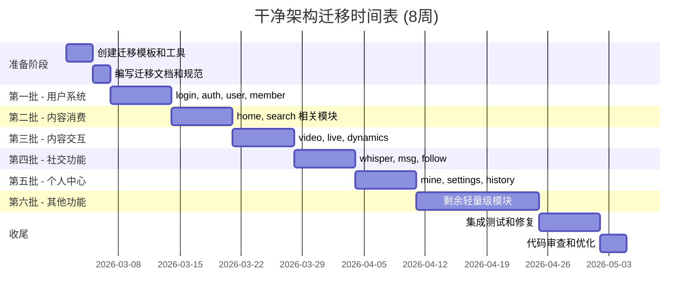

# 干净架构迁移设计文档

**项目**: PiliPlus 干净架构重构
**日期**: 2026-03-01
**状态**: 设计阶段
**目标**: 在 1-2 个月内将所有 80+ 个功能模块从 GetX 迁移到干净架构 + Riverpod

---

## 目录

- [1. 整体架构设计](#1-整体架构设计)
- [2. 特性分组与迁移顺序](#2-特性分组与迁移顺序)
- [3. 目录结构与代码组织](#3-目录结构与代码组织)
- [4. 数据流与状态管理](#4-数据流与状态管理)
- [5. 错误处理](#5-错误处理)
- [6. 迁移工具与模板](#6-迁移工具与模板)
- [7. 测试策略](#7-测试策略)
- [8. 迁移时间表](#8-迁移时间表)
- [9. 风险与缓解措施](#9-风险与缓解措施)
- [10. 成功标准](#10-成功标准)

---

## 1. 整体架构设计

基于干净架构原则，每个功能模块将遵循以下三层结构：

```
┌─────────────────────────────────────────────────┐
│           Presentation Layer                    │
│  - Pages: 页面和路由                             │
│  - Widgets: UI 组件                              │
│  - Providers: Riverpod 状态管理                 │
│  - Controllers: 用户交互处理                     │
└───────────────────┬─────────────────────────────┘
                    │ 依赖
┌───────────────────┴─────────────────────────────┐
│              Domain Layer                       │
│  - Entities: 领域实体（纯业务对象）              │
│  - Repositories: 仓库接口（抽象）                │
│  - Use Cases: 用例（业务逻辑）                   │
│  - Failures: 错误类型定义                        │
└───────────────────┬─────────────────────────────┘
                    │ 实现
┌───────────────────┴─────────────────────────────┐
│              Data Layer                         │
│  - DataSources: 数据源（API、本地存储）          │
│  - Models: 数据模型（DTO）                       │
│  - RepositoryImpls: 仓库实现                    │
│  - Mappers: 实体与模型转换                       │
└─────────────────────────────────────────────────┘
```

### 依赖规则

- **Domain 层**: 不依赖任何外层，纯粹的业务逻辑
- **Data 层**: 实现 Domain 层定义的接口
- **Presentation 层**: 通过 Use Case 调用业务逻辑
- **依赖方向**: 所有依赖指向内部（依赖倒置原则）

---

## 2. 特性分组与迁移顺序

将 80+ 模块按业务功能分组，按依赖关系排序：

### 第一批：用户系统 (Week 2-3)

**模块**: `login`, `auth`, `user`, `member`

**优先级**: 最高（其他模块依赖）

**关键功能**:
- 用户登录
- 认证管理
- 用户信息
- 会员详情

---

### 第二批：内容消费 (Week 3-4)

**模块**: `home`, `home_rcmd`, `home_hot`, `home_live`, `home_pgc`, `search`, `search_result`

**优先级**: 高（核心用户场景）

**关键功能**:
- 首页展示
- 内容推荐
- 热门内容
- 搜索功能

---

### 第三批：内容交互 (Week 4-5)

**模块**: `video`, `live`, `live_room`, `dynamics`, `reply`, `article`

**优先级**: 高（主要使用场景）

**关键功能**:
- 视频播放
- 直播观看
- 动态浏览
- 评论互动

---

### 第四批：社交功能 (Week 5-6)

**模块**: `whisper`, `msg`, `follow`, `followed`, `follow_type`, `dynamics_create`

**优先级**: 中

**关键功能**:
- 私信聊天
- 消息通知
- 关注管理
- 发布动态

---

### 第五批：个人中心 (Week 6-7)

**模块**: `mine`, `settings`, `history`, `favorite`, `subscription`, `later`, `blacklist`

**优先级**: 中

**关键功能**:
- 个人主页
- 设置管理
- 历史记录
- 收藏管理

---

### 第六批：其他功能 (Week 7-8)

**剩余 40+ 轻量级模块**

**优先级**: 低

**策略**: 使用模板快速迁移

---

## 3. 目录结构与代码组织

### 标准模块结构

每个 feature 模块遵循统一的结构：

```
lib/features/{feature_name}/
├── domain/                      # 领域层
│   ├── entities/               # 实体类
│   │   └── {name}_entity.dart
│   ├── repositories/           # 仓库接口
│   │   └── {name}_repository.dart
│   └── usecases/              # 用例
│       ├── get_{entity}.dart
│       ├── update_{entity}.dart
│       └── delete_{entity}.dart
├── data/                       # 数据层
│   ├── datasources/           # 数据源
│   │   ├── {name}_remote_datasource.dart
│   │   └── {name}_local_datasource.dart
│   ├── models/                # 数据模型
│   │   └── {name}_model.dart
│   ├── repositories/          # 仓库实现
│   │   └── {name}_repository_impl.dart
│   └── mappers/               # 实体转换
│       └── {name}_mapper.dart
├── presentation/              # 表现层
│   ├── providers/            # Riverpod providers
│   │   ├── {name}_providers.dart
│   │   └── {name}_controller.dart
│   ├── pages/                # 页面
│   │   └── {name}_page.dart
│   └── widgets/              # 组件
│       ├── {name}_card.dart
│       └── {name}_list.dart
└── README.md                 # 模块文档
```

### 全局共享结构

```
lib/
├── core/                      # 核心层（跨模块共享）
│   ├── error/                # 错误处理
│   │   ├── failures.dart
│   │   └── exceptions.dart
│   ├── network/              # 网络层
│   │   ├── http_client.dart
│   │   └── api_constants.dart
│   ├── storage/              # 本地存储
│   │   └── storage_service.dart
│   └── constants/            # 常量
│       └── app_constants.dart
├── shared/                    # 共享组件
│   ├── widgets/              # 通用组件
│   └── utils/                # 通用工具
└── app/                      # 应用层
    ├── router/               # 路由配置
    └── theme/                # 主题配置
```

---

## 4. 数据流与状态管理

### Riverpod Provider 层级

```dart
// 1. 数据源 Provider
@riverpod
RawClientApi rawClientApi(RawClientApiRef ref) {
  return RawClientApi();
}

// 2. 仓库实现 Provider
@riverpod
VideoRepository videoRepository(VideoRepositoryRef ref) {
  final datasource = VideoRemoteDatasource(ref.watch(rawClientApiProvider));
  return VideoRepositoryImpl(datasource);
}

// 3. 用例 Provider
@riverpod
GetVideoDetailUseCase getVideoDetailUseCase(GetVideoDetailUseCaseRef ref) {
  return GetVideoDetailUseCase(ref.watch(videoRepositoryProvider));
}

// 4. 状态管理 Provider (Controller)
@riverpod
class VideoController extends _$VideoController {
  @override
  Future<VideoDetailEntity> build(String bvid) async {
    final useCase = ref.read(getVideoDetailUseCaseProvider);
    return await useCase(params: GetVideoDetailParams(bvid: bvid));
  }

  Future<void> refresh() async {
    state = const AsyncValue.loading();
    ref.invalidateSelf();
  }
}
```

### UI 使用示例

```dart
class VideoPage extends ConsumerWidget {
  final String bvid;

  @override
  Widget build(BuildContext context, WidgetRef ref) {
    final videoState = ref.watch(videoControllerProvider(bvid));

    return videoState.when(
      data: (detail) => VideoDetailWidget(detail: detail),
      loading: () => CircularProgressIndicator(),
      error: (err, stack) => ErrorWidget(err.toString()),
    );
  }
}
```

---

## 5. 错误处理

### Failure 类型定义

```dart
// lib/core/error/failures.dart
abstract class Failure {
  final String message;
  final int? code;

  const Failure(this.message, {this.code});
}

class ServerFailure extends Failure {
  const ServerFailure(super.message, {super.code});
}

class NetworkFailure extends Failure {
  const NetworkFailure(super.message);
}

class CacheFailure extends Failure {
  const CacheFailure(super.message);
}

class ValidationFailure extends Failure {
  const ValidationFailure(super.message);
}

class UnauthorizedFailure extends Failure {
  const UnauthorizedFailure() : super('未授权');
}

class NotFoundFailure extends Failure {
  const NotFoundFailure() : super('资源不存在');
}
```

### UseCase 错误处理

```dart
// lib/features/{feature}/domain/usecases/get_{entity}.dart
class GetVideoDetailUseCase {
  final VideoRepository repository;

  GetVideoDetailUseCase(this.repository);

  Future<Either<Failure, VideoDetailEntity>> call({
    required String bvid,
  }) async {
    // 验证参数
    if (bvid.isEmpty) {
      return const Left(ValidationFailure('bvid 不能为空'));
    }

    try {
      final result = await repository.getVideoDetail(bvid: bvid);
      return Right(result);
    } on ServerException {
      return const Left(ServerFailure('服务器错误'));
    } on NetworkException {
      return const Left(NetworkFailure('网络连接失败'));
    } catch (e) {
      return Left(ServerFailure(e.toString()));
    }
  }
}
```

---

## 6. 迁移工具与模板

### 代码生成工具

使用 `riverpod_generator` + `build_runner` 自动生成 Provider 代码：

```bash
# 安装
flutter pub add dev:build_runner dev:riverpod_generator dev:riverpod_lint

# 运行
flutter pub run build_runner watch --delete-conflicting-outputs
```

### 迁移检查清单

每个模块迁移完成后需验证：

- [ ] Domain 层无外部依赖
- [ ] Repository 接口在 Domain 层
- [ ] Data 层实现 Repository 接口
- [ ] Presentation 层只通过 UseCase 调用业务逻辑
- [ ] 所有异步操作使用 Either<Failure, T> 返回
- [ ] 无 GetX 依赖（除兼容层）
- [ ] 功能测试通过
- [ ] 代码格式化通过 (`dart format .`)
- [ ] 静态分析通过 (`flutter analyze`)

---

## 7. 测试策略

### 测试金字塔

```
        ┌─────────┐
       /  E2E     \      少量端到端测试
      /   Tests    \
     ───────────────
    /  Integration  \    适量集成测试
   /     Tests       \
  ─────────────────────
 /    Unit Tests     \  大量单元测试
/_____________________\
```

### Domain 层测试示例

```dart
test('should get video detail from repository', () async {
  // Arrange
  final mockRepository = MockVideoRepository();
  final useCase = GetVideoDetailUseCase(mockRepository);
  const bvid = 'BV1xx411c7mD';

  when(() => mockRepository.getVideoDetail(bvid: bvid))
    .thenAnswer((_) async => VideoDetailEntity(title: 'Test'));

  // Act
  final result = await useCase(params: GetVideoDetailParams(bvid: bvid));

  // Assert
  expect(result.isRight(), true);
  expect(result.getOrElse(() => VideoDetailEntity()).title, 'Test');
});
```

### Data 层测试示例

```dart
test('should return VideoModel when API call is successful', () async {
  // Arrange
  final mockApi = MockRawClientApi();
  final datasource = VideoRemoteDatasource(mockApi);

  when(() => mockApi.get('/video/detail', queryParameters: any()))
    .thenResponse({'code': 0, 'data': {'bvid': 'BV1xx', 'title': 'Test'}});

  // Act
  final result = await datasource.getVideoDetail(bvid: 'BV1xx');

  // Assert
  expect(result.title, 'Test');
});
```

### Presentation 层测试示例

```dart
test('should show loading state', () {
  // Arrange
  final container = ProviderContainer();
  addTearDown(container.dispose);

  // Act
  container.read(videoControllerProvider('BV1xx'));

  // Assert
  expect(
    container.read(videoControllerProvider('BV1xx')),
    isA<AsyncLoading>(),
  );
});
```

---

## 8. 迁移时间表



### 每周检查点

- **Week 1-2**: 模板创建完成，至少完成 1 个示例模块
- **Week 4**: 核心功能（登录、首页、视频）可正常使用
- **Week 6**: 主要功能模块迁移完成 60%
- **Week 7**: 开始批量迁移边缘模块
- **Week 8**: 全部功能迁移完成，进入测试优化阶段

---

## 9. 风险与缓解措施

| 风险 | 影响 | 概率 | 缓解措施 |
|------|------|------|----------|
| 时间不足，无法完成所有模块 | 高 | 中 | 优先保证核心模块，边缘模块可延后 |
| 迁移过程中引入新 bug | 高 | 中 | 充分测试，保持 Git 历史可回退 |
| 团队成员不熟悉新架构 | 中 | 低 | 提供详细文档和示例代码 |
| 模块间依赖复杂，迁移困难 | 中 | 中 | 按依赖顺序迁移，创建适配层 |
| Riverpod 学习曲线 | 低 | 低 | 使用代码生成，简化使用 |

---

## 10. 成功标准

迁移完成后应达到以下标准：

### 架构合规性
- ✅ 所有模块遵循三层架构
- ✅ Domain 层无外部依赖
- ✅ 无 GetX 依赖（除兼容代码）

### 代码质量
- ✅ `flutter analyze` 无错误
- ✅ `dart format .` 格式化通过
- ✅ 核心模块测试覆盖率 > 60%

### 功能完整性
- ✅ 所有现有功能正常工作
- ✅ 无性能回退
- ✅ 无用户可见 bug

### 文档完善性
- ✅ 迁移指南文档完整
- ✅ 每个模块有 README 说明
- ✅ 架构决策记录（ADR）完整

---

## 附录

### 参考文档
- [干净架构原则](https://blog.cleancoder.com/uncle-bob/2012/08/13/the-clean-architecture.html)
- [Riverpod 官方文档](https://riverpod.dev/)
- [Flutter 最佳实践](https://flutter.dev/docs/development/data-and-backend/state-mgmt/options)

### 相关文件
- 迁移规范: `docs/CLEAN_ARCHITECTURE_MIGRATION.md`
- 代码示例: `lib/features/video/README.md`
