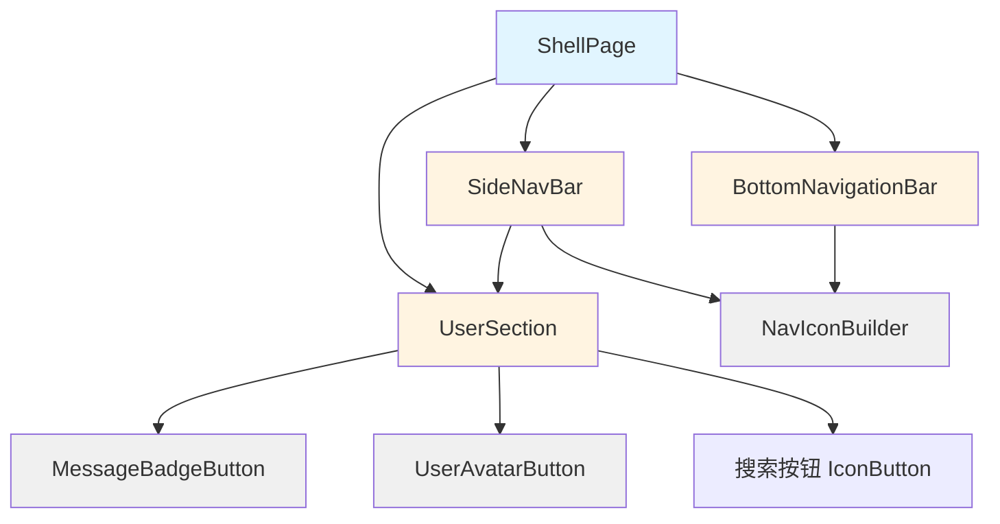

# Shell Page 组件抽离设计文档

**创建日期:** 2026-03-01
**状态:** 已批准
**作者:** Claude
**目标:** 提高 shell_page.dart 的可维护性和符合单一职责原则

---

## 📋 设计概述

将 `shell_page.dart`（当前 485 行）重构为模块化的组件结构，主页面减少到约 150 行，同时创建 6 个可独立维护的 UI 组件。

### 重构目标

- ✅ 提高代码可维护性
- ✅ 符合单一职责原则
- ✅ 保持功能完全一致
- ✅ 符合项目干净架构方向

### 预期收益

- 主页面代码量减少 70%（485 行 → ~150 行）
- 6 个职责清晰的独立组件
- 便于后续维护和扩展
- 符合 Flutter 最佳实践

---

## 📁 目录结构

### 新目录结构

```
lib/features/shell/presentation/
├── pages/
│   └── shell_page.dart                    # 主页面（~150行）
└── widgets/
    ├── bottom_nav_bar.dart                # 底部导航栏（~30行）
    ├── side_nav_bar.dart                  # 侧边导航栏（~50行）
    ├── nav_icon_builder.dart              # 导航图标构建器（~20行）
    ├── user_avatar_button.dart            # 用户头像按钮（~40行）
    ├── message_badge_button.dart          # 消息角标按钮（~30行）
    └── user_section.dart                  # 用户区域组合（~30行）
```

### 组织原则

- `pages/` - 只存放页面级组件（含生命周期管理）
- `widgets/` - 存放可复用的 UI 组件
- 组件命名使用 snake_case，保持 Flutter 风格

---

## 🎯 组件职责划分

### 1. ShellPage (主页面)

**文件:** `lib/features/shell/presentation/pages/shell_page.dart`

**职责:**
- 页面生命周期管理（initState, dispose）
- 导航状态协调
- 响应式布局控制（竖屏/横屏、移动端/桌面端）
- 平台特定适配（Android/桌面）
- Provider 监听和组件组合

**保留的代码:**
- 状态管理（`_padding`, `directExitOnBack`）
- 生命周期方法（`initState`, `dispose`, `didChangeDependencies`）
- 导航处理逻辑（`_handlePop`, `_handleNavTap`, `_onBack`）
- `build()` 方法的布局逻辑（响应式判断、组件组合）

**移除的内容:**
- 所有 `_build*()` 私有方法（移到独立组件）

---

### 2. BottomNavigationBar

**文件:** `lib/features/shell/presentation/widgets/bottom_nav_bar.dart`

**职责:**
- 渲染底部导航栏 UI
- 处理导航项点击事件
- 显示当前选中状态

**参数:**
```dart
final NavigationConfig config;
final int dynCount;
final ValueChanged<int> onDestinationSelected;
```

**来源:** 原 `_buildBottomNav()` 方法

---

### 3. SideNavBar

**文件:** `lib/features/shell/presentation/widgets/side_nav_bar.dart`

**职责:**
- 渲染侧边导航栏 UI（使用 NavigationRail）
- 集成用户区域组件
- 显示当前选中状态

**参数:**
```dart
final NavigationConfig config;
final int dynCount;
final DynamicBadgeMode dynamicBadgeMode;
final ThemeData theme;
final ValueChanged<int> onDestinationSelected;
```

**来源:** 原 `_buildSideBar()` 方法

---

### 4. NavIconBuilder

**文件:** `lib/features/shell/presentation/widgets/nav_icon_builder.dart`

**职责:**
- 根据导航类型和选中状态构建图标
- 为动态页面显示未读角标

**参数:**
```dart
final NavigationBarType type;
final bool selected;
final int dynCount;
```

**返回:** `Widget`

**来源:** 原 `_buildIcon()` 方法

---

### 5. UserAvatarButton

**文件:** `lib/features/shell/presentation/widgets/user_avatar_button.dart`

**职责:**
- 显示用户头像或默认图标
- 处理登录/未登录状态
- 响应点击事件跳转到"我的"页面

**参数:**
```dart
final String? faceUrl;
final bool isLogin;
final VoidCallback onTap;
final ThemeData theme;
```

**来源:** 原 `_buildUserAvatar()` 方法

**关键改动:**
- 移除 `Obx()` 依赖，改为普通参数
- 使用 `NetworkImgLayer` 显示头像

---

### 6. MessageBadgeButton

**文件:** `lib/features/shell/presentation/widgets/message_badge_button.dart`

**职责:**
- 显示消息图标和未读角标
- 根据角标模式显示数字或圆点
- 处理点击跳转到消息页面

**参数:**
```dart
final UnreadMessage unreadMessage;
final DynamicBadgeMode badgeMode;
final VoidCallback onPressed;
```

**来源:** 原 `_buildMsgBadge()` 方法

**关键逻辑:**
- 使用 `showMsgBadge()` 判断是否显示
- 根据 `badgeMode` 显示数字或圆点

---

### 7. UserSection

**文件:** `lib/features/shell/presentation/widgets/user_section.dart`

**职责:**
- 垂直排列搜索、消息、头像三个组件
- 组合三个独立组件

**参数:**
```dart
final ThemeData theme;
final DynamicBadgeMode dynamicBadgeMode;
final UnreadMessage unreadMessage;
final DynamicBadgeMode msgBadgeMode;
final int dynCount;
final VoidCallback onSearchPressed;
final VoidCallback onMessagePressed;
final VoidCallback onUserTap;
final bool isLogin;
final String? faceUrl;
```

**来源:** 原 `_buildUserAndSearchVertical()` 方法

---

## 🔄 数据流和依赖关系

### 依赖关系图



### 数据流向

**1. 从 Provider 获取数据（ShellPage）**
```dart
final navConfigState = ref.watch(navigationConfigControllerProvider);
final unreadDyn = ref.watch(unreadDynamicControllerProvider);
final unreadMsg = ref.watch(unreadMessageControllerProvider);
final dynamicBadgeMode = ref.read(dynamicBadgeModeProvider);
final msgBadgeMode = ref.read(msgBadgeModeProvider);
```

**2. 向子组件传递数据**
```dart
BottomNavigationBar(
  config: navConfigState.config,
  dynCount: unreadDyn.count,
  onDestinationSelected: _handleNavTap,
)

SideNavBar(
  config: navConfigState.config,
  dynCount: unreadDyn.count,
  dynamicBadgeMode: dynamicBadgeMode,
  theme: theme,
  onDestinationSelected: _handleNavTap,
)
```

**3. AccountService 转换（关键改动）**
```dart
// 原代码：在组件中使用 Obx
Obx(() => NetworkImgLayer(src: accountService.face.value))

// 新代码：在 ShellPage 中转换为普通值
final accountService = Get.find<AccountService>();
final isLogin = accountService.isLogin.value;
final faceUrl = accountService.face.value;

// 传递给组件
UserAvatarButton(
  isLogin: isLogin,
  faceUrl: faceUrl,
  onTap: () => widget.navigationShell.goBranch(2),
  theme: theme,
)
```

**4. 用户操作回传**
```dart
// 子组件 → ShellPage → Provider/Navigation
onDestinationSelected: (index) {
  widget.navigationShell.goBranch(index);
  ref.read(navigationConfigControllerProvider.notifier).updateIndex(index);
}
```

### 组件间通信原则

1. **单向数据流** - 数据从上向下传递，事件从下向上传递
2. **纯函数组件** - 所有抽离的组件都是无状态的 `StatelessWidget`
3. **回调函数** - 使用 `ValueChanged<T>` 和 `VoidCallback` 传递事件
4. **无直接依赖** - 子组件之间不直接通信，只通过父组件协调

---

## 🔧 关键实现细节

### 1. 组件状态管理

**所有抽离的组件都是 `StatelessWidget`**，原因：
- 状态由 ShellPage 的 Provider 管理
- 组件只负责渲染，不持有业务状态
- 便于测试和复用

### 2. 响应式布局处理

**保留在 ShellPage：**
```dart
final useBottomNav = MediaQuery.sizeOf(context).isPortrait;
final shouldUseBottomNav = useBottomNav && config.navigationBars.length >= 2;
```

**子组件不需要关心：**
- 屏幕方向判断
- 平台类型判断
- 这些在 ShellPage 层处理

### 3. 导航处理

**原代码：** 在 `_buildUserAvatar()` 中直接调用
```dart
onTap: () => widget.navigationShell.goBranch(2),
```

**新代码：** 通过回调传递
```dart
// ShellPage
UserAvatarButton(
  onTap: () => widget.navigationShell.goBranch(2),
)

// UserAvatarButton
Widget build(BuildContext context) {
  return GestureDetector(
    onTap: widget.onTap,
    child: // ...
  );
}
```

---

## 📝 迁移步骤

### 阶段 1：创建组件文件

1. 创建 `lib/features/shell/presentation/widgets/` 目录
2. 按以下顺序创建组件文件（每个组件独立验证）：
   - `nav_icon_builder.dart` （最简单，无依赖）
   - `user_avatar_button.dart`
   - `message_badge_button.dart`
   - `user_section.dart`
   - `bottom_nav_bar.dart`
   - `side_nav_bar.dart`

### 阶段 2：迁移代码

对于每个组件：
1. 将对应方法的代码复制到组件文件
2. 修改为 `StatelessWidget`
3. 提取必要的参数
4. 调整导入语句
5. 运行 `flutter analyze` 验证编译

### 阶段 3：重构 ShellPage

1. 添加新组件的导入
2. 在 `build()` 方法中替换方法调用为组件实例化
3. 处理 AccountService 的 `Obx()` 依赖（在 build 中读取值）
4. 删除已迁移的私有方法
5. 验证布局和功能

### 阶段 4：验证和测试

1. 运行 `flutter analyze`（必须无错误）
2. 在 Linux 平台运行测试（30秒超时）
3. 手动验证功能：
   - ✅ 底部导航栏切换
   - ✅ 侧边导航栏切换
   - ✅ 用户头像点击
   - ✅ 消息角标显示
   - ✅ 响应式布局（竖屏/横屏）

---

## ⚠️ 风险和注意事项

### 风险点

**1. AccountService Obx 依赖**
- **风险：** 当前使用 `Obx()` 监听，迁移后需要手动传递
- **缓解：** 在 ShellPage 的 `build()` 方法中读取值并传递
- **示例：** 见上文"数据流向"部分

**2. NavigationShell 引用**
- **风险：** `UserAvatarButton` 需要调用 `goBranch(2)`
- **缓解：** 通过 `onTap` 回调传递，子组件不直接引用

**3. Provider 读取**
- **风险：** 某些组件读取 provider（如 `dynamicBadgeModeProvider`）
- **缓解：** 在 ShellPage 读取后作为参数传递

**4. 导入依赖**
- **风险：** 新组件需要导入多个文件
- **缓解：** 使用相对导入，保持清晰

### 注意事项

1. **保持向后兼容** - 确保迁移后功能完全一致
2. **渐进式迁移** - 一次迁移一个组件，验证后再继续
3. **保留注释** - 迁移代码注释，便于理解业务逻辑
4. **类型安全** - 使用命名参数和必需参数提高可读性
5. **代码风格** - 遵循项目现有代码风格

---

## 📊 验收标准

### 代码质量
- [ ] `flutter analyze` 无错误
- [ ] 所有组件使用 `StatelessWidget`
- [ ] 无 `Obx()` 依赖（AccountService 在父组件处理）
- [ ] 命名符合 Flutter 规范

### 功能验证
- [ ] 底部导航栏正常切换
- [ ] 侧边导航栏正常切换
- [ ] 用户头像显示正确（登录/未登录状态）
- [ ] 消息角标显示正确（数字/圆点模式）
- [ ] 响应式布局正常（竖屏/横屏切换）
- [ ] 所有点击事件正常响应

### 代码量
- [ ] `shell_page.dart` 减少到约 150 行
- [ ] 创建 6 个新的组件文件
- [ ] 总代码量无明显增加（主要是重组）

---

## 🎯 设计原则遵循

### 干净架构
- ✅ 组件位于 presentation 层
- ✅ 依赖方向正确（组件不依赖业务逻辑）
- ✅ 职责单一

### Flutter 最佳实践
- ✅ 使用 `StatelessWidget`（纯 UI 组件）
- ✅ 单向数据流
- ✅ 命名参数
- ✅ 明确的类型定义

### 项目一致性
- ✅ 符合现有的 feature 结构
- ✅ 符合 GetX → Riverpod 迁移方向
- ✅ 保持代码风格一致

---

## 📚 参考资料

- [Flutter 最佳实践](https://flutter.dev/docs/development/data-and-backend/state-mgmt/simple)
- [干净架构迁移指南](../CLEAN_ARCHITECTURE_MIGRATION.md)
- [项目开发规范](../../CLAUDE.md)

---

**文档状态:** ✅ 已批准，等待实施
