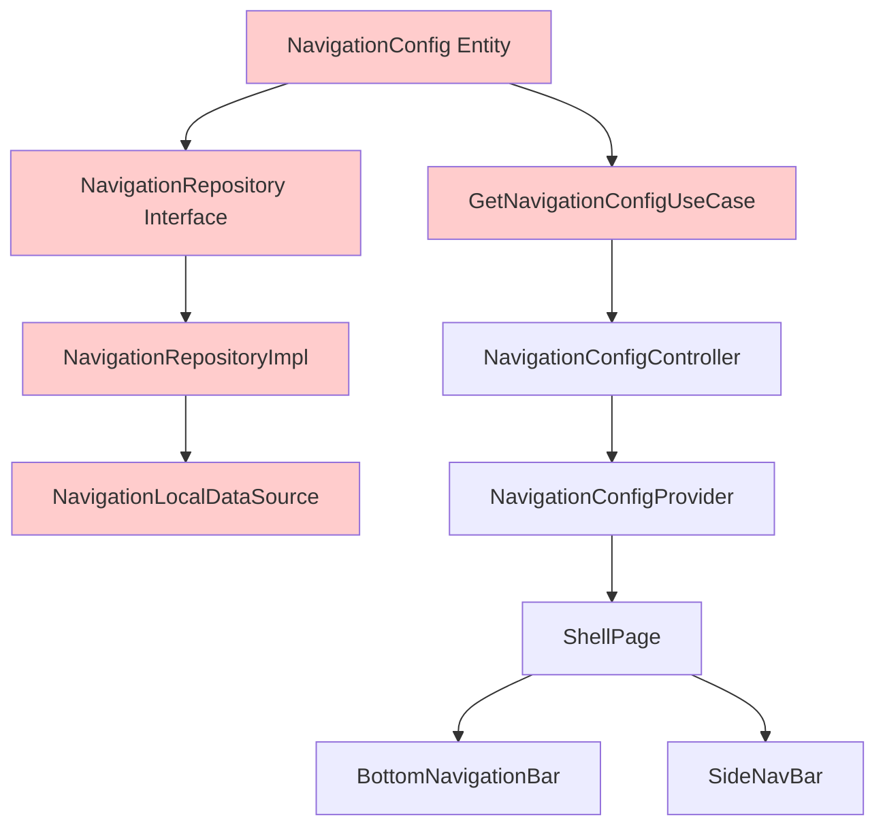
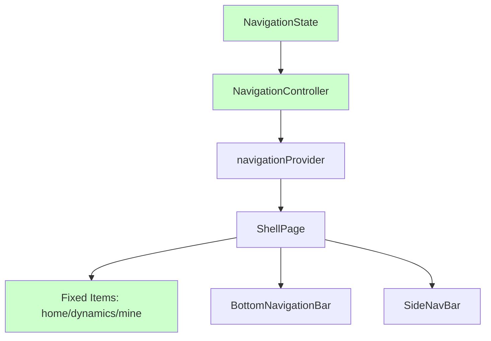

# Shell 导航配置简化设计文档

**创建日期:** 2026-03-01
**状态:** 已批准
**作者:** Claude
**目标:** 移除过度设计的 NavigationConfig 配置系统，简化为固定三个导航选项

---

## 📋 设计概述

将 Shell 导航从动态配置系统简化为固定的三个导航选项（首页、动态、我的），删除所有不必要的配置相关代码和数据层。

### 重构目标

- ✅ 移除未使用的过度设计功能
- ✅ 简化状态管理逻辑
- ✅ 删除约 246 行不必要的代码
- ✅ 保持所有现有功能

### 预期收益

- **代码减少：** ~246 行（删除 176 行 + 简化 70 行）
- **复杂度降低：** 移除完整的 Repository、UseCase、DataSource 层
- **维护性提升：** 固定导航选项更清晰直观
- **性能优化：** 避免运行时动态配置加载

---

## 🏗️ 当前架构（复杂）

### 架构图



### 问题分析

1. **过度设计：** 导航选项是固定的，不需要动态配置系统
2. **数据层冗余：** Repository、UseCase、DataSource 层完全不需要
3. **代码量过大：** NavigationConfig 实体 + 相关代码约 246 行
4. **维护成本高：** 多层抽象增加了理解和修改难度

### 当前文件结构

```
lib/features/shell/
├── domain/
│   ├── entities/
│   │   └── navigation_config.dart          (66 lines)
│   ├── repositories/
│   │   └── navigation_repository.dart      (10 lines)
│   └── usecases/
│       └── get_navigation_config.dart      (20 lines)
├── data/
│   ├── datasources/
│   │   └── navigation_local_datasource.dart  (30 lines)
│   └── repositories/
│       └── navigation_repository_impl.dart   (20 lines)
└── presentation/
    └── providers/
        └── navigation_provider.dart        (100 lines)
```

---

## 🎯 新架构（简化）

### 架构图



### 核心改进

1. **移除配置实体：** 删除 NavigationConfig 及其所有配置项
2. **移除数据层：** 删除 Repository、UseCase、DataSource
3. **简化状态：** 只保留 selectedIndex 状态
4. **固定导航：** 硬编码三个导航选项

### 新文件结构

```
lib/features/shell/
├── domain/
│   └── entities/
│       └── navigation_state.dart           (10 lines) - NEW
├── presentation/
│   └── providers/
│       └── navigation_provider.dart        (30 lines) - SIMPLIFIED
```

---

## 📦 数据结构定义

### NavigationState（新建）

**文件:** `lib/features/shell/domain/entities/navigation_state.dart`

```dart
/// 导航状态
///
/// 管理导航栏选中状态
class NavigationState {
  /// 当前选中的索引
  final int selectedIndex;

  const NavigationState({this.selectedIndex = 0});

  NavigationState copyWith({int? selectedIndex}) {
    return NavigationState(
      selectedIndex: selectedIndex ?? this.selectedIndex,
    );
  }
}
```

**特点：**
- 只管理 selectedIndex 状态
- 提供不可变性（copyWith）
- 默认索引为 0（首页）

---

## 🔧 状态管理

### NavigationController（简化）

**文件:** `lib/features/shell/presentation/providers/navigation_provider.dart`

**修改前（~100 行）：**
```dart
@riverpod
class NavigationConfigController extends _$NavigationConfigController {
  @override
  Future<NavigationConfig> build() async {
    // 加载配置...
    final repository = ref.watch(navigationRepositoryProvider);
    final config = await repository.getNavigationConfig();
    return config;
  }

  Future<void> initialize() async {
    // 初始化逻辑...
  }

  void updateIndex(int index) {
    // 更新索引...
  }

  void reset() {
    // 重置...
  }
}
```

**修改后（~30 行）：**
```dart
@riverpod
class Navigation extends _$Navigation {
  @override
  NavigationState build() => const NavigationState();

  /// 更新选中的导航索引
  void updateIndex(int index) {
    // 验证索引范围（0-2）
    if (index >= 0 && index < 3) {
      state = state.copyWith(selectedIndex: index);
    }
  }

  /// 重置到首页
  void reset() {
    state = const NavigationState(selectedIndex: 0);
  }
}
```

**改进：**
- 移除异步初始化
- 移除 Repository 依赖
- 添加索引范围验证
- 代码量减少 70%

---

## 🎨 UI 组件修改

### 1. ShellPage 修改

**文件:** `lib/features/shell/presentation/pages/shell_page.dart`

**修改前：**
```dart
class _ShellPageState extends ConsumerState<ShellPage> {
  @override
  Widget build(BuildContext context) {
    final navConfigState = ref.watch(navigationConfigControllerProvider);
    final config = navConfigState.config;

    // 使用 config.navigationBars, config.selectedIndex 等...
  }
}
```

**修改后：**
```dart
class _ShellPageState extends ConsumerState<ShellPage> {
  // 固定的导航选项
  static const List<NavigationBarType> _navigationItems = [
    NavigationBarType.home,
    NavigationBarType.dynamics,
    NavigationBarType.mine,
  ];

  @override
  Widget build(BuildContext context) {
    final selectedIndex = ref.watch(navigationProvider).selectedIndex;

    // 直接使用 _navigationItems 和 selectedIndex...
  }

  void _handleNavTap(int index) {
    // 验证索引
    if (index >= 0 && index < _navigationItems.length) {
      ref.read(navigationProvider.notifier).updateIndex(index);
      widget.navigationShell.goBranch(index);
      // ...
    }
  }
}
```

**关键改动：**
- 删除 `navigationConfigControllerProvider` 监听
- 添加固定的 `_navigationItems` 常量
- 简化 `_handleNavTap` 方法

---

### 2. BottomNavigationBar 修改

**文件:** `lib/features/shell/presentation/widgets/bottom_nav_bar.dart`

**修改前：**
```dart
class ShellBottomNavigationBar extends StatelessWidget {
  const ShellBottomNavigationBar({
    super.key,
    required this.config,      // NavigationConfig
    required this.dynCount,
    required this.onDestinationSelected,
  });

  final NavigationConfig config;
  // ...
}
```

**修改后：**
```dart
class ShellBottomNavigationBar extends StatelessWidget {
  const ShellBottomNavigationBar({
    super.key,
    required this.items,       // 固定列表
    required this.selectedIndex,
    required this.dynCount,
    required this.onDestinationSelected,
  });

  final List<NavigationBarType> items;
  final int selectedIndex;
  // ...
}
```

---

### 3. SideNavBar 修改

**文件:** `lib/features/shell/presentation/widgets/side_nav_bar.dart`

类似 BottomNavigationBar，移除 `config` 参数，直接传递 `items` 和 `selectedIndex`。

---

## 📁 文件删除清单

### Domain 层删除（3 个文件）

1. **删除:** `lib/features/shell/domain/entities/navigation_config.dart`
   - 大小：66 行
   - 原因：配置实体不再需要

2. **删除:** `lib/features/shell/domain/repositories/navigation_repository.dart`
   - 大小：~10 行
   - 原因：Repository 接口不再需要

3. **删除:** `lib/features/shell/domain/usecases/get_navigation_config.dart`
   - 大小：~20 行
   - 原因：UseCase 不再需要

### Data 层删除（2 个文件）

4. **删除:** `lib/features/shell/data/datasources/navigation_local_datasource.dart`
   - 大小：~30 行
   - 原因：本地数据源不再需要

5. **删除:** `lib/features/shell/data/repositories/navigation_repository_impl.dart`
   - 大小：~20 行
   - 原因：Repository 实现不再需要

### Provider 层简化

6. **修改:** `lib/features/shell/presentation/providers/navigation_provider.dart`
   - 原大小：~100 行
   - 新大小：~30 行
   - 减少：70 行

### 总计

- **删除文件：** 5 个
- **删除代码：** 176 行
- **简化代码：** 70 行
- **总减少：** 246 行

---

## 🔄 迁移步骤

### 阶段 1：创建新的状态管理

1. 创建 `navigation_state.dart`
2. 简化 `navigation_provider.dart`
3. 运行 `flutter analyze` 验证

### 阶段 2：修改 UI 组件

4. 修改 `ShellPage` 使用新状态
5. 修改 `BottomNavigationBar` 组件
6. 修改 `SideNavBar` 组件
7. 运行 `flutter analyze` 验证

### 阶段 3：清理旧代码

8. 删除 5 个旧文件
9. 删除未使用的导入
10. 运行 `flutter analyze` 和测试验证

### 阶段 4：验证和测试

11. 验证导航功能正常
12. 验证响应式布局（竖屏/横屏）
13. 提交代码

---

## ⚠️ 风险和注意事项

### 风险点

**1. Provider 名称变更**
- **风险：** `navigationConfigControllerProvider` → `navigationProvider`
- **影响：** 需要更新所有引用位置
- **缓解：** 使用全局搜索替换

**2. 导航选项硬编码**
- **风险：** 未来添加新导航项需要修改代码
- **缓解：** 这是预期行为，三个选项已满足所有需求

**3. 配置删除**
- **风险：** 可能有其他模块依赖 NavigationConfig
- **缓解：** 使用 `grep` 搜索所有引用

### 注意事项

1. **备份当前代码：** 确保可以回滚
2. **渐进式迁移：** 一次完成所有修改
3. **测试覆盖：** 验证所有导航场景
4. **保留枚举：** NavigationBarType 枚举仍然需要

---

## ✅ 验收标准

### 代码质量
- [ ] `flutter analyze` 无错误
- [ ] 所有旧文件删除
- [ ] 新的 NavigationState 创建
- [ ] NavigationController 简化到 ~30 行

### 功能验证
- [ ] 底部导航栏正常工作
- [ ] 侧边导航栏正常工作
- [ ] 导航切换正确
- [ ] 选中状态正确显示
- [ ] 双击刷新功能正常

### 代码减少
- [ ] 删除 5 个配置相关文件
- [ ] 代码总减少 ~246 行
- [ ] Provider 文件从 ~100 行减少到 ~30 行

---

## 📊 重构前后对比

### 复杂度对比

| 指标 | 重构前 | 重构后 | 改进 |
|------|--------|--------|------|
| 文件数量 | 12 个 | 7 个 | -42% |
| 代码行数 | ~486 行 | ~240 行 | -51% |
| 抽象层数 | 5 层 | 1 层 | -80% |
| 状态管理 | 异步复杂 | 同步简单 | 显著简化 |

### 架构对比

**重构前：**
- Entity → Repository → DataSource → UseCase → Controller → UI

**重构后：**
- State → Controller → UI

---

## 🎯 设计原则遵循

### YAGNI（You Aren't Gonna Need It）
- ✅ 移除不需要的动态配置功能
- ✅ 删除过度设计的抽象层

### KISS（Keep It Simple, Stupid）
- ✅ 固定导航选项，简化逻辑
- ✅ 直接状态管理，无需异步加载

### 干净架构
- ✅ 保留必要的分层
- ✅ 移除不必要的中间层

---

## 📚 参考资料

- [当前 NavigationConfig 实现](../../lib/features/shell/domain/entities/navigation_config.dart)
- [当前 NavigationController 实现](../../lib/features/shell/presentation/providers/navigation_provider.dart)
- [NavigationBarType 枚举定义](../../lib/models/common/nav_bar_config.dart)

---

**文档状态:** ✅ 已批准，等待实施
